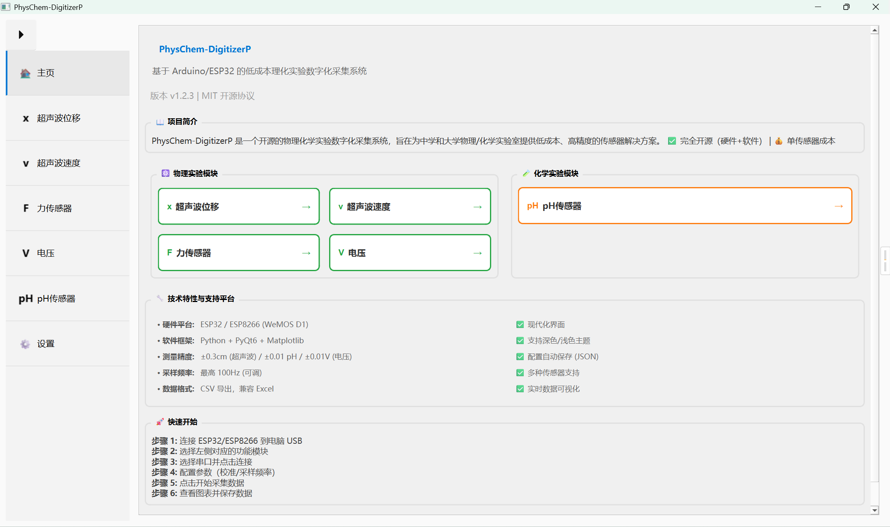
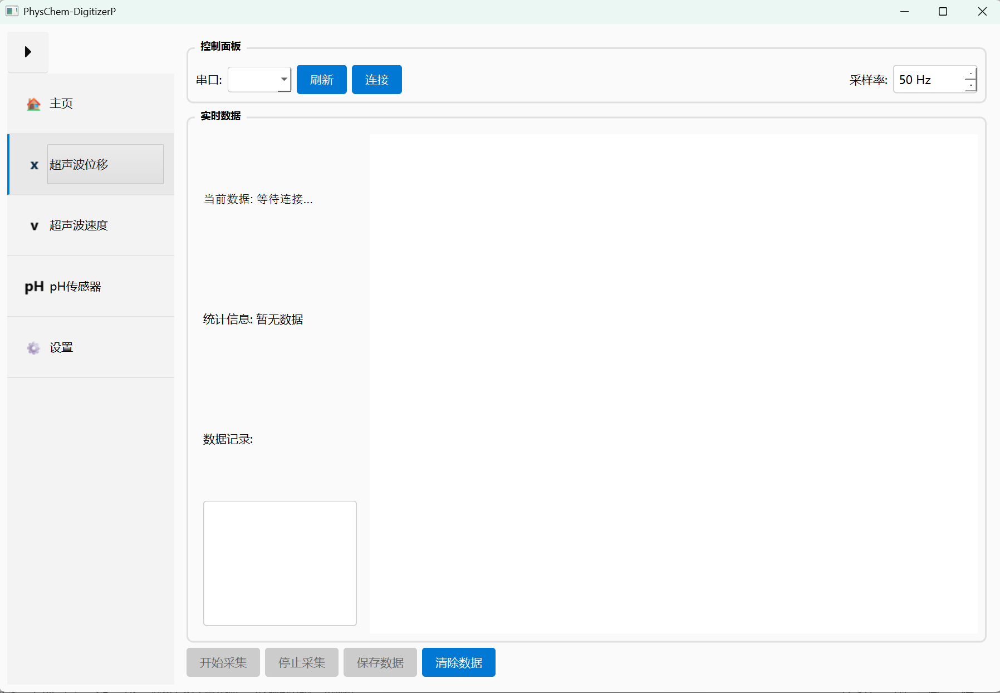
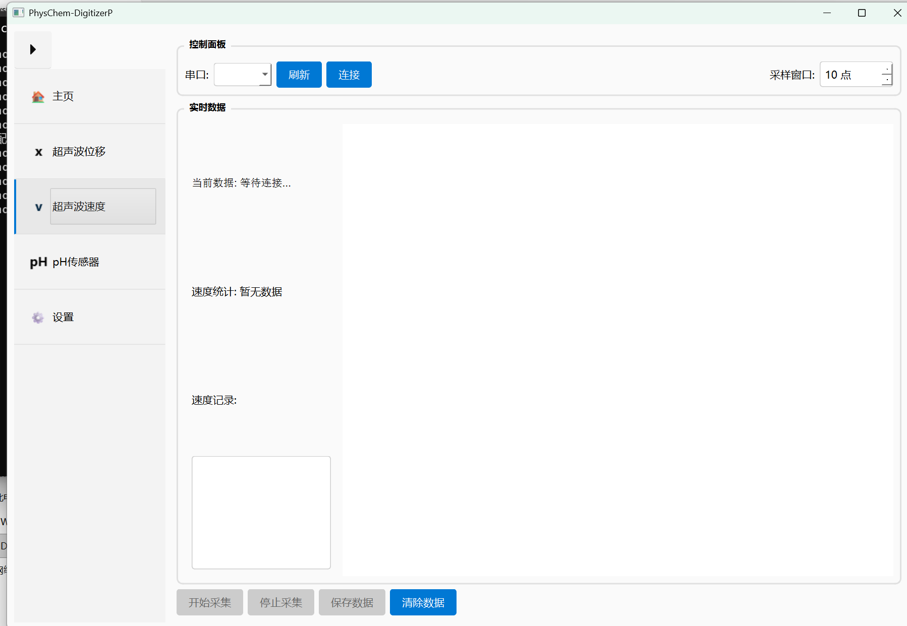
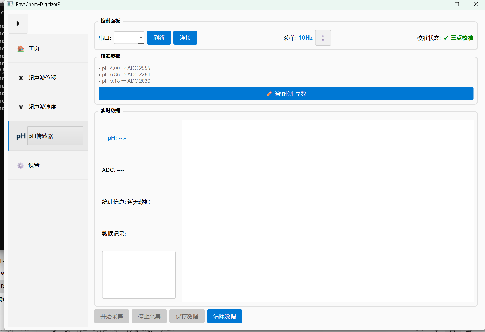
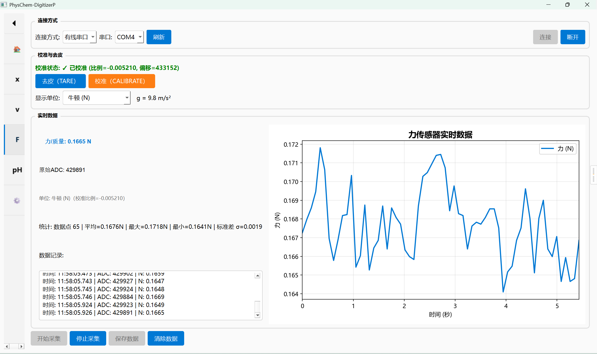
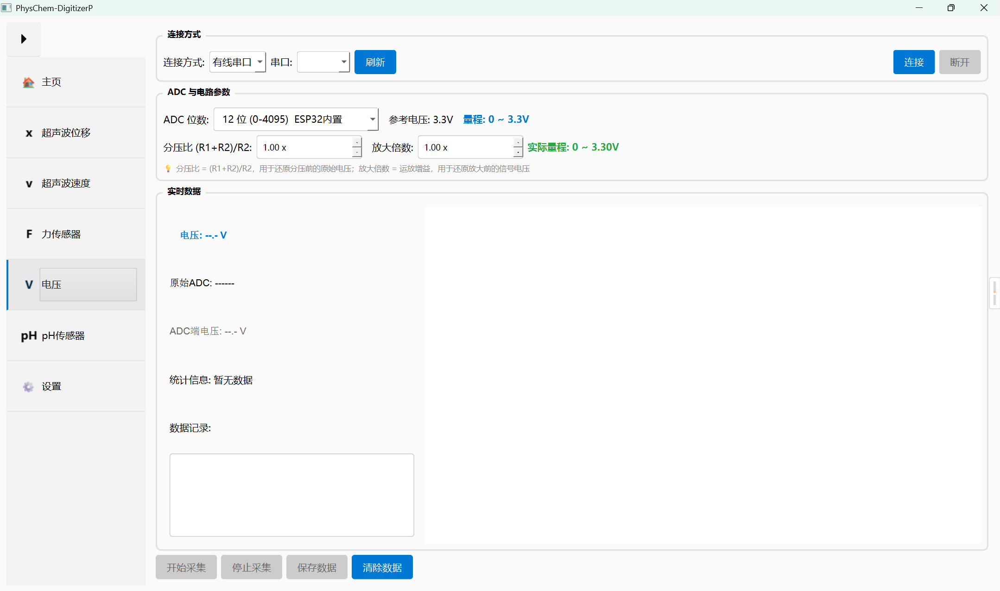
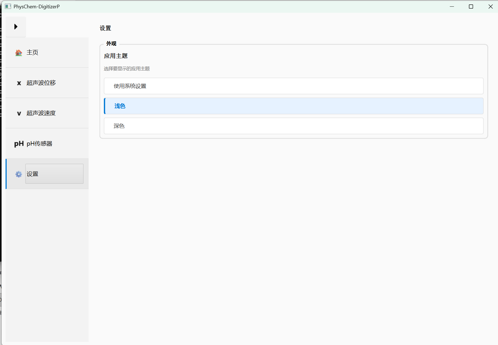

# PhysChem-DigitizerP

基于 Arduino/ESP32/ESP8266 开发的低成本理化实验数字化采集系统

[](LICENSE)
[](https://github.com/wangzhidong2/PhysChem-DigitizerP)
[](https://gitee.com/wangzhidong2/PhysChem-DigitizerP/)
[](https://gitcode.com/wangzhidong2/PhysChem-DigitizerP)

## 📦 核心依赖库

| 库 | 版本 | 用途 |
|----|------|------|
| **PyQt6** | ≥6.4.0 | 图形界面框架 |
| **pyserial** | ≥3.5 | 串口通信 |
| **matplotlib** | ≥3.5.0 | 数据可视化 |
| **numpy** | ≥1.21.0 | 数值计算 |

安装命令：
```bash
pip install PyQt6>=6.4.0 pyserial>=3.5 matplotlib>=3.5.0 numpy>=1.21.0
```

## 📖 项目简介

**PhysChem-DigitizerP** 是一个开源的物理化学实验数字化采集系统，旨在为中学物理/化学实验室提供低成本的传感器解决方案。项目包含硬件（ESP32/ESP8266/Arduino）和软件（Python + PyQt6）两部分，实现了从传感器数据采集、实时可视化到数据导出的完整功能。

<p align="center">
  
</p>
<p align="center">软件主界面 — 模块导航与项目概览</p>

### 🎯 项目目标

- **低成本替代**：为昂贵的商业理化实验传感器提供经济实惠的开源替代方案
- **开源透明**：所有硬件设计和软件代码完全开源，支持二次开发和定制
- **易于使用**：现代化的图形界面，直观的操作流程
- **高扩展性**：模块化设计，支持多种传感器类型的快速接入

---

## 📋 硬件准备 (BOM)

### 所需材料

| 组件 | 型号/规格 | 数量 | 备注 |
|------|-----------|------|------|
| 开发板 | ESP32 或 ESP8266 (WeMOS D1) | 1 | 推荐使用 ESP32 |
| 传感器模块 | 根据实验需求选择 | 1 | HC-SR04 / SEN0161 / HX711 等 |
| 杜邦线 | 公对母 | 若干 | 根据传感器需求 |
| USB 线 | Micro-USB 或 Type-C | 1 | 数据通信和供电 |

> 💡 **成本估算**：单传感器成本 < ¥30（商业方案通常 > ¥500）

---

## 🔌 接线指南

> ⚠️ **以下为简要接线参考，具体接线、注意事项及故障排查请参阅各模块详细文档：**
> - [超声波位移传感器](传感器代码/超声波位移传感器/README.md)
> - [pH 传感器](传感器代码/ph传感器/README.md)
> - [力传感器](传感器代码/力传感器/README.md)
> - [电压传感器](传感器代码/电压传感器/README.md)

### HC-SR04 超声波传感器接线

> 📖 详细接线说明和注意事项请参考：[超声波位移传感器使用说明](传感器代码/超声波位移传感器/README.md)

**ESP8266 (WeMOS D1) 连接：**
```
WeMOS D1          HC-SR04
─────────         ───────
5V (VIN)    →     VCC
GND         →     GND
D14 (D5)    →     TRIG
D12 (D6)    →     ECHO
```

**ESP32 连接：**
```
ESP32             HC-SR04
─────             ───────
5V (VIN)    →     VCC
GND         →     GND
GPIO 5      →     TRIG
GPIO 18     →     ECHO
```

**⚠️ 注意**：请根据具体传感器模块的电压要求连接电源引脚。

### HX711 力/质量传感器接线

> 📖 详细接线说明、校准方法和常见问题请参考：[力传感器使用说明](传感器代码/力传感器/README.md)

**ESP32-S3 连接：**
```
ESP32-S3          HX711 模块
─────────         ──────────
3.3V        →     VCC
GND         →     GND
GPIO4       →     DT (DOUT)
GPIO5       →     SCK (PD_SCK)
```

**HX711 模块 ↔ 称重传感器：**
```
HX711 模块        称重传感器
─────────        ──────────
E+          →    激励正极（红色线）
E-          →    激励负极（黑色线）
A+          →    通道A正极（绿色线）
A-          →    通道A负极（白色线）
```

**⚠️ 注意**：称重传感器线序因厂家不同可能有所差异，请以传感器标注为准。

---

## 🚀 核心功能

### 硬件特性

- **主控板**：支持 ESP32 和 ESP8266（WeMOS D1 等），支持 WiFi 连接（预留功能）
- **精确测量**：支持多种传感器模块，测量精度高
- **多传感器支持**：已实现超声波位移、pH 值、力/质量传感器，预留温度、光电门等接口

### 软件特性

#### ✅ 已实现功能

1. **位移测量模块**
   - 实时距离测量（精度：±0.3cm）
   - 距离 - 时间曲线实时绘制
   - 数据统计（平均值、最大值、最小值）
   - CSV 格式数据导出

<p align="center">
  
</p>
<p align="center">超声波位移测量界面</p>

2. **速度测量模块**
   - 基于连续距离测量的速度计算
   - 双图表显示（距离 - 时间、速度 - 时间）
   - 速度统计分析

<p align="center">
  
</p>
<p align="center">超声波速度测量界面</p>

3. **pH 传感器模块**
   - 多模式校准功能（**单点 / 两点 / 三点校准**）
     - **单点校准**：使用 Nernst 理论斜率（-59mV/pH），快速粗略校准
     - **两点校准**：线性拟合，适用于一般测量场景
     - **三点校准**：二次多项式拟合，高精度测量
   - 校准模式动态切换，UI 根据所选模式自动调整
   - 支持 ADC 原始值 / 电压值输入（适配带信号调理的传感器）
   - 实时 pH 值显示和曲线绘制
   - Python 程序内校准（非模块校准）
   - 数据统计（平均值、标准差）

> 📖 详细接线、校准方法和电极保养请参考：[pH 传感器使用说明](传感器代码/ph传感器/README.md)

<p align="center">
  
</p>
<p align="center">pH 传感器测量界面（含多模式校准）</p>

4. **力/质量传感器模块**
   - 基于 HX711 24位高精度 ADC 的力/质量测量
   - 去皮（TARE）功能，支持清零当前负载
   - 两点校准（空载 + 已知砝码），自动保存校准参数
   - 实时力/质量值显示和曲线绘制
   - 数据统计（平均值、最大值、最小值、标准差）
   - CSV 格式数据导出

> 📖 详细接线、校准方法和常见问题请参考：[力传感器使用说明](传感器代码/力传感器/README.md)

<p align="center">
  
</p>
<p align="center">力/质量传感器测量界面（含去皮与校准）</p>

5. **电压传感器模块**
   - 基于 ESP32-S3 内置 12 位 ADC 的模拟电压采集（0-3.3V）
   - 支持通过分压电阻网络扩展测量范围至更高电压
   - 实时电压值显示和曲线绘制
   - 数据统计（平均值、最大值、最小值、标准差）
   - CSV 格式数据导出
   - 支持偏移校准和增益校准

> 📖 详细接线、固件说明和扩展建议请参考：[电压传感器使用说明](传感器代码/电压传感器/README.md)

<p align="center">
  
</p>
<p align="center">电压传感器测量界面</p>

6. **现代化界面**
   - 现代化设计语言
   - 侧边栏模块化导航
   - 响应式布局
   - 实时数据可视化

#### 🔧 规划中功能

- 温度传感器模块
- 光电门模块
- WiFi 无线数据传输

---

## 📦 项目结构

项目采用**模块化架构**——主程序启动时扫描 `传感器代码/` 目录，自动加载每个传感器的上位机模块（`.py`）。新增传感器无需修改主程序，只需在子目录中放入模块文件并在文件头写好识别区即可。

```
PhysChem-DigitizerP/
├── main.py                     # 主程序：主页 + 侧边栏 + 动态加载器
├── core.py                     # 公共模块：SerialThread / BLESerialThread / 配置 / 对话框 / Win11 样式
├── main_legacy.py              # 历史存档（迁移前单文件版本，不再维护）
├── test_serial.py              # 串口连接测试工具
├── sensor_config.json          # 传感器校准配置（运行时自动生成）
├── README.md                   # 主文档（本文件）
├── AGENTS.md                   # 开发者指南（含添加新模块教程）
├── .gitignore                  # Git 忽略配置
├── LICENSE                     # MIT 许可证
├── docs/
│   └── images/                 # 文档图片
└── 传感器代码/                  # 下位机 .ino + 上位机 .py 同目录
    ├── README.md               # 各传感器固件与模块总览
    ├── 超声波位移传感器/
    │   ├── HC-SR04esp32.ino    # ESP32 传感器固件
    │   ├── HC-SR04esp8266.ino  # ESP8266 传感器固件
    │   ├── csbwithbt.ino       # ESP32-S3 + BLE 固件
    │   ├── ultrasonic_displacement.py  # 位移测量上位机模块
    │   └── ultrasonic_velocity.py      # 速度测量上位机模块
    ├── ph传感器/
    │   ├── ph esp32.ino        # ESP32-S3 pH 传感器固件
    │   ├── PH传感器原理图.pdf
    │   └── ph_sensor.py        # pH 上位机模块
    ├── 力传感器/
    │   ├── force.ino           # ESP32-S3 HX711 传感器固件
    │   ├── force_sensor.py     # 力/质量上位机模块
    │   └── 资料（HX711称重模块商家提供的）/
    ├── 电压传感器/
    │   ├── ESP32_Voltage_Sensor.ino  # ESP32-S3 ADC 采集固件
    │   ├── HX711_Voltage.ino         # HX711 24 位 ADC 电压采集固件
    │   └── voltage_sensor.py         # 电压上位机模块（支持 HX711 模式）
    └── 电流传感器/              # 仅下位机，上位机模块待添加
        └── ESP32_ADC_Raw_Data.ino
```

> 📖 模块加载机制、识别区格式与添加新模块的完整教程请参考 [AGENTS.md](AGENTS.md)。

---

## 🛠️ 软件安装

#### 1. 环境要求

- **操作系统**：Windows 10/11（推荐），macOS，Linux
- **Python 版本**：Python 3.8 或更高
- **Arduino IDE**：1.8.x 或 2.x（用于烧录固件）

#### 2. 烧录 Arduino 固件

1. 安装 Arduino IDE 并添加开发板支持：
   - **ESP8266**：添加 `http://arduino.esp8266.com/stable/package_esp8266com_index.json`
   - **ESP32**：添加 `https://dl.espressif.com/dl/package_esp32_index.json`
   - **ESP32 国内镜像（推荐）**：`https://jihulab.com/esp-mirror/espressif/arduino-esp32/-/raw/gh-pages/package_esp32_index_cn.json`
   - 文件 → 首选项 → 附加开发板管理器网址 → 粘贴上述地址
   - 工具 → 开发板 → 开发板管理器 → 搜索 "esp32" → 选择带 "-cn" 的版本安装

2. 上传代码：
   - 根据你的开发板选择对应的固件文件
   - ESP8266：选择开发板 **WeMos D1 R1**
   - ESP32：选择开发板 **ESP32 Dev Module**
   - 选择正确的端口（如 COM3）
   - 点击上传按钮

3. 验证固件工作：
   - 打开 Arduino IDE 串口监视器
   - 设置波特率：**115200**
   - 应看到 "START" 启动信息和数据输出

#### 3. 安装 Python 软件

```bash
pip install PyQt6>=6.4.0 pyserial>=3.5 matplotlib>=3.5.0 numpy>=1.21.0
```

---

## 💻 使用指南

### 启动软件

```bash
python main.py
```

### 操作流程

#### 1. 位移测量

1. **连接硬件**：将 ESP32/ESP8266 通过 USB 连接到电脑
2. **选择模块**：在软件左侧选择 "位移测量" 模块
3. **选择串口**：点击 "刷新" 按钮，选择对应的 COM 端口
4. **建立连接**：点击 "连接" 按钮，状态显示 "已连接"
5. **开始采集**：点击 "开始采集"，实时显示距离数据
6. **观察数据**：
   - 文本区域显示详细数据记录
   - 图表区域显示距离 - 时间曲线
   - 统计信息实时更新
7. **停止采集**：点击 "停止采集" 结束
8. **保存数据**：点击 "保存数据"，导出为 CSV 文件

#### 2. 速度测量（回声定位法）

操作流程与位移测量类似，不同之处：
- 选择 "速度测量" 模块
- 软件自动计算瞬时速度
- 显示双图表：距离 - 时间 + 速度 - 时间

### 数据格式说明

#### 串口通信协议

**输出格式**：`时间戳 (us),测量值 (us)`

**示例**：
```
123456,1450
123476,1465
123496,1440
```

#### CSV 导出格式

**位移数据** (`sensor_data_YYYYMMDD_HHMMSS.csv`)：
```csv
timestamp_ms,distance_cm
0,12.345
100,12.567
200,12.789
```

**速度数据** (`velocity_data_YYYYMMDD_HHMMSS.csv`)：
```csv
time_s,distance_cm,velocity_cm_s
0.000,12.345,
0.100,12.567,2.22
0.200,12.789,2.20
```

---

## 📐 计算原理与数学表达式

### 1. 速度测量（回声定位法）

**原理**：通过连续两次超声波回波时间的差值，结合声速和测量间隔计算物体运动速度。

**数学表达式**：

```
v = (t₀ - t₁)/2 × vₛ / [(t₁ + t₀)/2 + Δt]
```

其中：
- `t₀`：第一次回波时间 (µs)
- `t₁`：第二次回波时间 (µs)
- `Δt`：两次发射的时间间隔 (s)
- `vₛ`：声速 = 34000 cm/s

**代码实现**（参考 [ultrasonic_velocity.py](传感器代码/超声波位移传感器/ultrasonic_velocity.py) 中的 `calculate_velocity` 方法）：

```python
def calculate_velocity(self):
    # 获取最近两次测量的数据
    t0 = self.echo_time_data[-2]  # 第一次回波时间 (µs)
    t1 = self.echo_time_data[-1]  # 第二次回波时间 (µs)
    
    # 计算两次发射的时间间隔 Δt (秒)
    delta_t = 0.02  # 默认 20ms
    
    # 声速 (cm/s)
    v_sound = 34000  # 340 m/s = 34000 cm/s
    
    # 计算速度 (cm/s)
    # v = (t₀ - t₁)/2 × vₛ / [(t₁ + t₀)/2 + Δt]
    numerator = (t0 - t1) / 2.0 * v_sound
    denominator = (t1 + t0) / 2.0 + delta_t * 1000000  # 将 Δt 转换为 µs
    
    velocity_cm_s = numerator / denominator
    
    return velocity_cm_s
```

---

### 2. pH 传感器（多模式校准）

**原理**：支持单点、两点、三点三种校准模式，根据精度需求和实验条件灵活选择。

#### 校准模式说明

| 模式 | 拟合方法 | 适用场景 | 精度 |
|------|----------|----------|------|
| **单点校准** | Nernst 理论斜率（-59mV/pH） | 快速粗略校准，已知理论斜率时 | 一般 |
| **两点校准** | 线性拟合 `pH = k·ADC + b` | 一般测量场景，覆盖常用 pH 范围 | 较高 |
| **三点校准** | 二次多项式拟合 `pH = a·ADC² + b·ADC + c` | 高精度测量，非线性补偿 | 最高 |

**数学表达式**：

**单点校准**（Nernst 方程）：
```
pH = pH_ref + slope × (V - V_ref)
```
其中 `slope` 为 Nernst 理论斜率（-59.16 mV/pH @25°C）

**两点校准**（线性拟合）：
```
pH = k·ADC + b
```

**三点校准**（二次多项式拟合）：
```
pH = a·ADC² + b·ADC + c
```

其中：
- `a`、`b`、`c`：二次拟合系数（通过三点校准获得）
- `k`、`b`：线性拟合系数（通过两点校准获得）
- `ADC`：传感器输出的原始 ADC 值（0-4095），或电压值（适配信号调理传感器）

**代码实现**（参考 [ph_sensor.py](传感器代码/ph传感器/ph_sensor.py) 中的校准相关方法）：

```python
def calculate_calibration_coefficients(self):
    """根据校准点数量自动选择拟合方法"""
    ph_values = [p[0] for p in self.calibration_points]
    adc_values = [p[1] for p in self.calibration_points]
    n_points = len(ph_values)

    if n_points == 1:
        # 单点校准：使用 Nernst 理论斜率
        pass  # 使用固定斜率计算
    elif n_points == 2:
        # 两点校准：线性拟合
        coefficients = np.polyfit(adc_values, ph_values, 1)
        self.cal_coeffs = coefficients  # [k, b]
    elif n_points >= 3:
        # 三点校准：二次多项式拟合
        coefficients = np.polyfit(adc_values, ph_values, 2)
        self.cal_coeffs = coefficients  # [a, b, c]

def adc_to_ph(self, adc_value):
    """将ADC原始值转换为pH值"""
    # 根据校准模式动态选择转换公式
    ...
```

**默认校准参数**：
```python
default_calibration = [
    (4.00, 2555),   # 酸性缓冲液 (pH 4.00 → ADC 2555)
    (6.86, 2281),   # 中性缓冲液 (pH 6.86 → ADC 2281)
    (9.18, 2030)    # 碱性缓冲液 (pH 9.18 → ADC 2030)
]
```

---

### 3. 力/质量传感器（HX711 两点校准线性换算）

**原理**：使用 HX711 24位高精度 ADC 读取称重传感器的原始值，通过两点校准（空载 + 已知砝码）建立 ADC 原始值与实际质量之间的线性换算关系。

**数学表达式**：

```
质量 = (ADC - offset) × scale
```

其中：
- `offset`：空载时的 ADC 原始值（去皮偏移量）
- `scale`：校准比例系数 = 已知质量 / (加载ADC - 空载ADC)
- `ADC`：传感器输出的 24位有符号原始值

**校准步骤**：
1. 空载时记录 ADC 值作为 offset
2. 放置已知质量砝码（如 100g），记录加载 ADC 值
3. 计算 scale = 已知质量 / (加载ADC - 空载ADC)

**示例**：
```
空载 ADC = -58720
加载 100g 砝码后 ADC = -52720
ADC 差值 = -52720 - (-58720) = 6000
scale = 100 / 6000 = 0.016667
offset = -58720

当 ADC = -55720 时：
质量 = (-55720 - (-58720)) × 0.016667 = 3000 × 0.016667 = 50.0g
```

> 校准参数自动保存到 `sensor_config.json`，下次启动时自动加载。

---


## 🔍 故障排除

### 快速诊断

```bash
python test_serial.py
```

该脚本自动检测所有串口并测试连接状态。

### 常见问题

| 问题 | 原因 | 解决方案 |
|------|------|----------|
| 找不到串口 | 驱动未安装/USB 未连接 | 安装 CH340G/CP210x 驱动，重新插拔 USB |
| 连接后无数据 | 波特率错误/固件未上传 | 确认波特率 115200，重新上传固件 |
| 数据跳变异常 | 传感器干扰/接线松动 | 检查接线，远离干扰源 |
| 图表不显示 | matplotlib 问题 | `pip install --upgrade matplotlib` |

### 诊断步骤

1. **验证固件**：打开 Arduino IDE 串口监视器（波特率 115200），应看到 `START` 和数据输出
2. **检查驱动**：设备管理器 → 端口 (COM 和 LPT)，确认开发板 COM 端口存在
3. **运行测试**：`python test_serial.py` 查看详细诊断信息

---

## 📚 技术文档

- **[AGENTS.md](AGENTS.md)** — 开发者指南：模块化架构说明、识别区格式、添加新模块完整教程
- **[传感器代码总览](传感器代码/README.md)** — 各传感器固件与上位机模块对照表
- **[超声波位移传感器使用说明](传感器代码/超声波位移传感器/README.md)** - HC-SR04 接线指南、固件说明、校准方法与性能优化
- **[pH 传感器使用说明](传感器代码/ph传感器/README.md)** - pH 传感器接线、多模式校准步骤（单点/两点/三点）、电极保养与常见问题
- **[力传感器使用说明](传感器代码/力传感器/README.md)** - HX711 力/质量传感器接线、去皮校准、数据采集与常见问题
- **[电压传感器使用说明](传感器代码/电压传感器/README.md)** - ESP32 ADC 电压采集接线指南、分压扩展方法、精度优化与常见问题

---

## 🔧 扩展开发

### 添加新传感器模块

项目采用**模块化架构**——主程序 `main.py` 启动时通过 `importlib` 扫描 `传感器代码/` 目录，自动加载带有识别区的 `.py` 模块文件。新增传感器**无需修改主程序**，只需 2 步：

1. 在 `传感器代码/` 下新建子目录，放入下位机 `.ino` 和上位机 `.py`
2. 在 `.py` 文件头写识别区（`icon` / `name` / `category` / `class`）

```python
# === MODULE META ===
# icon: T
# name: 温度传感器
# category: physics          # physics 或 chemistry
# class: TemperatureSensorWidget
# ===================

# -*- coding: utf-8 -*-
"""温度传感器模块"""

from core import (
    SerialThread, load_sensor_config, save_sensor_config,
    card_style, primary_btn_style, accent_btn_style, win11_combo_style,
)

class TemperatureSensorWidget(QWidget):
    def __init__(self):
        ...
```

重启 `main.py` 即自动出现在侧边栏 + 主页卡片 + 内容栈。

> 📖 完整字段说明、目录结构示例与注意事项请参考 [AGENTS.md - 添加新传感器模块](AGENTS.md#添加新传感器模块)。


## 🖥️ 软件界面

<p align="center">
  
</p>
<p align="center">设置界面 — 外观主题切换</p>

### 界面元素

- **左侧侧边栏**：模块选择导航
- **串口控制**：选择端口、刷新、连接/断开
- **实时数据**：当前值、统计信息、数据记录
- **图表区域**：实时数据曲线
- **操作按钮**：开始/停止采集、保存数据、清除数据

---

## 🤝 贡献指南

欢迎贡献代码、报告问题或提出建议！

### 开发环境设置

```bash
# GitHub
git clone https://github.com/wangzhidong2/PhysChem-DigitizerP.git

# Gitee（国内推荐）
git clone https://gitee.com/wangzhidong2/PhysChem-DigitizerP.git

# GitCode
git clone https://gitcode.com/wangzhidong2/PhysChem-DigitizerP.git

cd PhysChem-DigitizerP
pip install PyQt6>=6.4.0 pyserial>=3.5 matplotlib>=3.5.0 numpy>=1.21.0
# 可选（BLE 无线通信）:
pip install bleak
```


## 📄 许可证

本项目采用 **MIT 许可证** - 详见 [LICENSE](LICENSE) 文件

---

## 👥 致谢

- **硬件平台**：[ESP32](https://www.espressif.com/) / [ESP8266 Community](https://www.esp8266.com/)
- **图形界面**：[PyQt6](https://www.riverbankcomputing.com/software/pyqt/)
- **数据可视化**：[Matplotlib](https://matplotlib.org/)
- **串口通信**：[pyserial](https://github.com/pyserial/pyserial)

---

## 📧 联系方式

如有问题或建议，请提交 [GitHub Issue](https://github.com/wangzhidong2/PhysChem-DigitizerP/issues) 或 [Gitee Issue](https://gitee.com/wangzhidong2/PhysChem-DigitizerP/issues)。

## 🌐 项目地址

- **GitHub**: [https://github.com/wangzhidong2/PhysChem-DigitizerP](https://github.com/wangzhidong2/PhysChem-DigitizerP)
- **Gitee**: [https://gitee.com/wangzhidong2/PhysChem-DigitizerP/](https://gitee.com/wangzhidong2/PhysChem-DigitizerP/)
- **GitCode**: [https://gitcode.com/wangzhidong2/PhysChem-DigitizerP](https://gitcode.com/wangzhidong2/PhysChem-DigitizerP)

---

**Happy Experimenting! 🔬📊**
