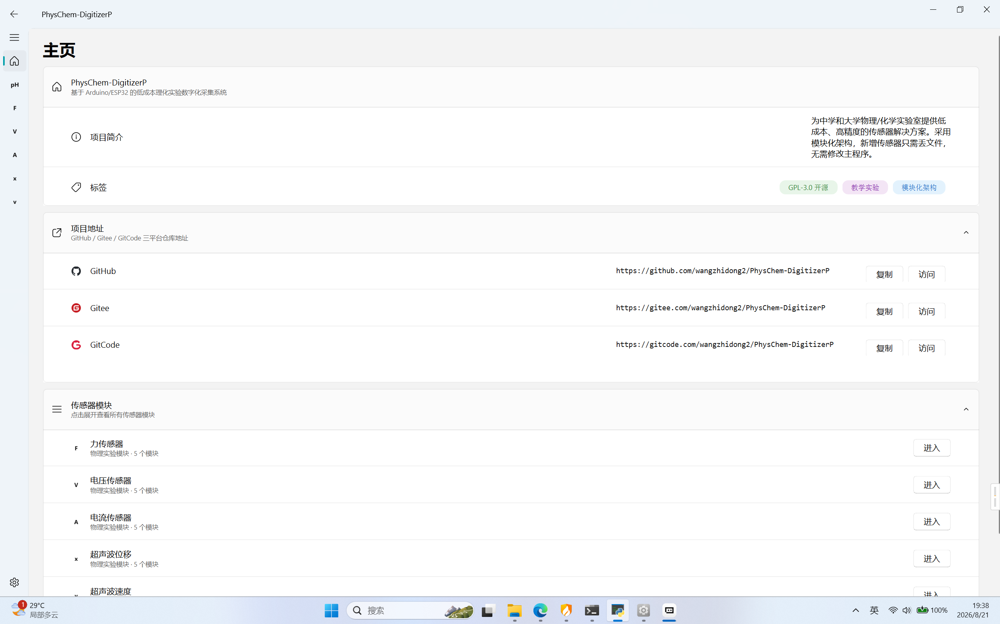
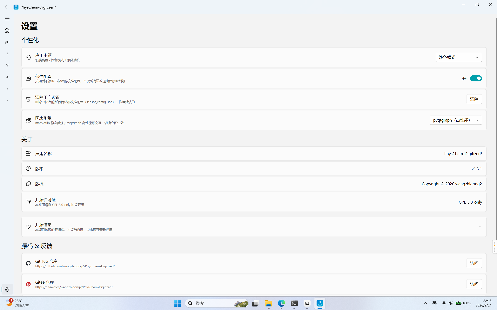

# PhysChem-DigitizerP

基于 Arduino/ESP32/ESP8266 开发的低成本理化实验数字化采集系统

[](LICENSE)
[](https://github.com/wangzhidong2/PhysChem-DigitizerP)
[](https://gitee.com/wangzhidong2/PhysChem-DigitizerP/)
[](https://gitcode.com/wangzhidong2/PhysChem-DigitizerP)

## 📖 项目简介

**PhysChem-DigitizerP** 是一个开源的物理化学实验数字化采集系统，旨在为中学物理/化学实验室提供低成本的传感器解决方案。项目包含硬件（ESP32/ESP8266/Arduino）和软件（Python + PySide6）两部分，实现了从传感器数据采集、实时可视化到数据导出的完整功能。

- **低成本替代**：单传感器成本 < ¥30（商业方案通常 > ¥500）
- **开源透明**：GPL-3.0 协议，硬件设计和软件代码完全开源
- **模块化设计**：新增传感器只需丢文件，无需修改主程序
- **现代化界面**：PySide6 图形界面，侧边栏导航 + 实时数据可视化
- **双绘图引擎**：matplotlib（静态美观）与 pyqtgraph（高性能交互）可在设置中一键热切换

<p align="center">
  
</p>
<p align="center">软件主界面 — 模块导航与项目概览</p>

## 📦 核心依赖库

| 库 | 版本 | 用途 |
|----|------|------|
| **PySide6** | ≥6.4.0 | 图形界面框架 |
| **PySide6-Fluent-Widgets** | — | WinUI3 风格组件库（主窗口基于 `FluentWindow`） |
| **pyserial** | ≥3.5 | 串口通信 |
| **matplotlib** | ≥3.5.0 | 数据可视化（默认绘图引擎，与 pyqtgraph 至少安装其一） |
| **pyqtgraph** | ≥0.13.0 | 高性能交互式绘图（与 matplotlib 至少安装其一） |
| **numpy** | ≥1.21.0 | 数值计算 |

```bash
pip install PySide6>=6.4.0 pyserial>=3.5 numpy>=1.21.0
# 绘图引擎（matplotlib / pyqtgraph 至少安装其一，推荐都装）
pip install matplotlib>=3.5.0 pyqtgraph>=0.13.0
# WinUI3 风格组件库（必需）
pip install PySide6-Fluent-Widgets
# 可选（BLE 无线通信）:
pip install bleak
```

## 🧩 功能模块

项目采用**模块化架构**——主程序 `main.py` 启动时扫描 `传感器代码/` 目录，自动加载每个传感器的上位机模块。每个模块的 BOM 物料清单、接线指南、校准方法、计算原理和常见问题均在各自的 README 中。

| 模块 | 传感器 | 开发板 | 类别 | 模块开源协议 | 说明文档 |
|------|--------|--------|------|--------------|----------|
| 超声波位移 | HC-SR04 | ESP32 / ESP8266 / ESP32-S3 | 物理 | GPL-3.0 | [使用说明](传感器代码/超声波位移传感器/README.md) |
| 超声波速度 | HC-SR04 | （共享上述固件） | 物理 | GPL-3.0 | [使用说明](传感器代码/超声波位移传感器/README.md) |
| pH 传感器 | SEN0161 | ESP32-S3 | 化学 | GPL-3.0 | [使用说明](传感器代码/ph传感器/README.md) |
| 力/质量传感器 | HX711 | ESP32-S3 | 物理 | GPL-3.0 | [使用说明](传感器代码/力传感器/README.md) |
| 电压传感器 | ESP32 ADC / HX711 | ESP32-S3 | 物理 | GPL-3.0 | [使用说明](传感器代码/电压传感器/README.md) |
| 电流传感器 | ACS712 | ESP32-S3 | 物理 | GPL-3.0 | [使用说明](传感器代码/电流传感器/)（ACS712 5A/20A/30A 量程，AC/DC，零点校准） |

## 📂 项目结构

```
PhysChem-DigitizerP/
├── main.py                     # 主程序：FluentWindow + 主页 + 动态加载器
├── core.py                     # 公共模块：SerialThread / BLESerialThread / 配置 / 对话框 / 现代化样式
├── main_legacy.py              # 历史存档（迁移前单文件版本，不再维护）
├── test_serial.py              # 串口连接测试工具
├── sensor_config.json          # 传感器校准配置（运行时自动生成，.gitignore）
├── README.md                   # 主文档（本文件）
├── AGENTS.md                   # 开发者指南（含添加新模块教程）
├── LICENSE                     # GPL-3.0 许可证
├── docs/
│   └── images/                 # 文档图片
└── 传感器代码/                  # 下位机 .ino + 上位机 .py 同目录
    ├── README.md               # 各传感器固件与模块总览
    ├── 超声波位移传感器/
    │   ├── README.md           # 使用说明（接线/校准/原理/FAQ）
    │   ├── HC-SR04esp32.ino    # ESP32 固件
    │   ├── HC-SR04esp8266.ino  # ESP8266 固件
    │   ├── csbwithbt.ino       # ESP32-S3 + BLE 固件
    │   ├── ultrasonic_displacement.py  # 位移测量上位机模块
    │   └── ultrasonic_velocity.py      # 速度测量上位机模块
    ├── ph传感器/
    │   ├── README.md           # 使用说明（接线/多模式校准/电极保养/FAQ）
    │   ├── ph esp32.ino        # ESP32-S3 固件
    │   ├── PH传感器原理图.pdf
    │   └── ph_sensor.py        # pH 上位机模块
    ├── 力传感器/
    │   ├── README.md           # 使用说明（接线/去皮校准/串口命令/FAQ）
    │   ├── force.ino           # ESP32-S3 HX711 固件
    │   ├── force_sensor.py     # 力/质量上位机模块
    │   └── 资料（HX711称重模块商家提供的）/
    ├── 电压传感器/
    │   ├── README.md           # 使用说明（接线/分压扩展/ADC配置/FAQ）
    │   ├── ESP32_Voltage_Sensor.ino  # ESP32-S3 内置 ADC 固件
    │   ├── HX711_Voltage.ino         # HX711 24 位 ADC 固件
    │   └── voltage_sensor.py         # 电压上位机模块（支持 HX711 模式）
    └── 电流传感器/              # ACS712 电流（5A/20A/30A，AC/DC，零点校准）
        ├── ESP32_ADC_Raw_Data.ino   # ESP32-S3 固件
        └── current_sensor.py        # 电流上位机模块（5A/20A/30A 量程，AC/DC）
```

> 📖 模块加载机制、识别区格式与添加新模块的完整教程请参考 [AGENTS.md](AGENTS.md)。

## 🛠️ 软件安装

### 1. 环境要求

- **操作系统**：Windows 10/11（推荐），macOS，Linux
- **Python**：3.8 或更高
- **Arduino IDE**：1.8.x 或 2.x（用于烧录固件）

### 2. 烧录 Arduino 固件

1. 安装 Arduino IDE 并添加开发板支持：
   - **ESP8266**：`http://arduino.esp8266.com/stable/package_esp8266com_index.json`
   - **ESP32**：`https://dl.espressif.com/dl/package_esp32_index.json`
   - **ESP32 国内镜像（推荐）**：`https://jihulab.com/esp-mirror/espressif/arduino-esp32/-/raw/gh-pages/package_esp32_index_cn.json`
   - 文件 → 首选项 → 附加开发板管理器网址 → 粘贴上述地址
   - 工具 → 开发板 → 开发板管理器 → 搜索 "esp32" → 安装

2. 选择对应固件烧录（各模块固件路径见上方"功能模块"表）：
   - ESP8266：开发板选 **WeMos D1 R1**
   - ESP32：开发板选 **ESP32 Dev Module**
   - 选择正确端口，点击上传

3. 验证固件：打开串口监视器（波特率 **115200**），应看到 `START` 和数据输出

### 3. 安装 Python 软件

```bash
pip install PySide6>=6.4.0 pyserial>=3.5 numpy>=1.21.0
# 绘图引擎（matplotlib / pyqtgraph 至少安装其一，推荐都装）
pip install matplotlib>=3.5.0 pyqtgraph>=0.13.0
# WinUI3 风格组件库（必需）
pip install PySide6-Fluent-Widgets
# 可选（BLE 无线通信）:
pip install bleak
```

## 💻 使用方法

### 启动软件

```bash
python main.py
```

### 通用操作流程

1. 通过 USB 连接开发板到电脑
2. 在软件左侧选择对应传感器模块
3. 点击"刷新"选择 COM 端口，点击"连接"
4. 点击"开始采集"实时显示数据与曲线
5. 点击"停止采集"结束
6. 点击"保存数据"导出为 CSV 文件

### 切换绘图引擎

进入 **设置 → 个性化 → 图表引擎**，可在两种引擎间即时切换（无需重启）：

| 引擎 | 特点 |
|------|------|
| **matplotlib（默认）** | 静态渲染、出版级美观，适合报告截图 |
| **pyqtgraph** | GPU 加速、支持缩放/平移拖拽，适合高频数据实时监视 |

切换立即对所有传感器模块生效，已绘制的曲线自动重放到新引擎；选择会保存到配置，下次启动沿用。

**引擎缺失时的表现**（程序不会崩溃，数据采集/保存不受影响）：
- 未安装的引擎在设置页下拉框中**灰显不可点击**（标注"未安装"）
- 配置的引擎被卸载时，启动自动降级到另一个可用引擎
- 两个引擎都未安装时，图表区域显示"未检测到图表引擎"占位提示，安装后重启即可恢复绘图

> 📖 各模块的具体接线、校准步骤和实验方法请参考对应的模块 README。

## 🔍 故障排除

### 快速诊断

```bash
python test_serial.py
```

### 常见问题

| 问题 | 原因 | 解决方案 |
|------|------|----------|
| 找不到串口 | 驱动未安装/USB 未连接 | 安装 CH340G/CP210x 驱动，重新插拔 USB |
| 连接后无数据 | 波特率错误/固件未上传 | 确认波特率 115200，重新上传固件 |
| 数据跳变异常 | 传感器干扰/接线松动 | 检查接线，远离干扰源 |
| 图表不显示 / 显示"未检测到图表引擎" | 绘图引擎未安装 | `pip install matplotlib pyqtgraph`（至少其一）后重启 |

## 📚 技术文档

- **[AGENTS.md](AGENTS.md)** — 开发者指南：模块化架构说明、识别区格式、添加新模块完整教程
- **[传感器代码总览](传感器代码/README.md)** — 各传感器固件与上位机模块对照表
- **[超声波位移传感器](传感器代码/超声波位移传感器/README.md)** — 接线指南、固件说明、校准方法与计算原理
- **[pH 传感器](传感器代码/ph传感器/README.md)** — 接线、多模式校准（单点/两点/三点）、电极保养
- **[力传感器](传感器代码/力传感器/README.md)** — HX711 接线、去皮校准、串口命令
- **[电压传感器](传感器代码/电压传感器/README.md)** — ADC 接线、分压扩展、精度优化

## 🔧 扩展开发

新增传感器**无需修改 `main.py`**，只需 2 步：

1. 在 `传感器代码/` 下新建子目录，放入 `.ino` 和 `.py`
2. 在 `.py` 文件头写识别区：

```python
# === MODULE META ===
# icon: T
# name: 温度传感器
# category: physics          # physics 或 chemistry
# class: TemperatureSensorWidget
# ===================
```

重启 `main.py` 即自动出现在侧边栏 + 主页卡片 + 内容栈。

> 📖 完整字段说明与注意事项请参考 [AGENTS.md](AGENTS.md)。

## 🖥️ 软件界面

<p align="center">
  
</p>
<p align="center">设置界面 — 主题与图表引擎切换</p>

- **左侧侧边栏**：WinUI3 风格导航（FluentWindow），模块图标由识别区文字渲染
- **串口控制**：选择端口、刷新、连接/断开
- **实时数据**：当前值、统计信息、数据记录
- **图表区域**：实时数据曲线（matplotlib / pyqtgraph 双引擎，设置中切换）
- **操作按钮**：开始/停止采集、保存数据、清除数据
- **设置页**：应用主题（亮/暗/跟随系统）、图表引擎切换（立即生效）、关于与源码链接

## 🤝 贡献指南

```bash
# GitHub
git clone https://github.com/wangzhidong2/PhysChem-DigitizerP.git
# Gitee（国内推荐）
git clone https://gitee.com/wangzhidong2/PhysChem-DigitizerP.git
# GitCode
git clone https://gitcode.com/wangzhidong2/PhysChem-DigitizerP.git

cd PhysChem-DigitizerP
pip install PySide6>=6.4.0 pyserial>=3.5 numpy>=1.21.0 matplotlib>=3.5.0 pyqtgraph>=0.13.0 PySide6-Fluent-Widgets
```

## 📄 许可证

本项目采用 **GNU General Public License v3.0** - 详见 [LICENSE](LICENSE) 文件

## 👥 致谢

- **硬件平台**：[ESP32](https://www.espressif.com/) / [ESP8266 Community](https://www.esp8266.com/)
- **图形界面**：[PySide6](https://www.qt.io/qt-for-python)
- **数据可视化**：[Matplotlib](https://matplotlib.org/) / [pyqtgraph](https://www.pyqtgraph.org/)
- **串口通信**：[pyserial](https://github.com/pyserial/pyserial)

## 📧 联系方式

如有问题或建议，请提交 [GitHub Issue](https://github.com/wangzhidong2/PhysChem-DigitizerP/issues) 或 [Gitee Issue](https://gitee.com/wangzhidong2/PhysChem-DigitizerP/issues)。

## 🌐 项目地址

- **GitHub**: [https://github.com/wangzhidong2/PhysChem-DigitizerP](https://github.com/wangzhidong2/PhysChem-DigitizerP)
- **Gitee**: [https://gitee.com/wangzhidong2/PhysChem-DigitizerP/](https://gitee.com/wangzhidong2/PhysChem-DigitizerP/)
- **GitCode**: [https://gitcode.com/wangzhidong2/PhysChem-DigitizerP](https://gitcode.com/wangzhidong2/PhysChem-DigitizerP)

---

**Happy Experimenting! 🔬📊**
