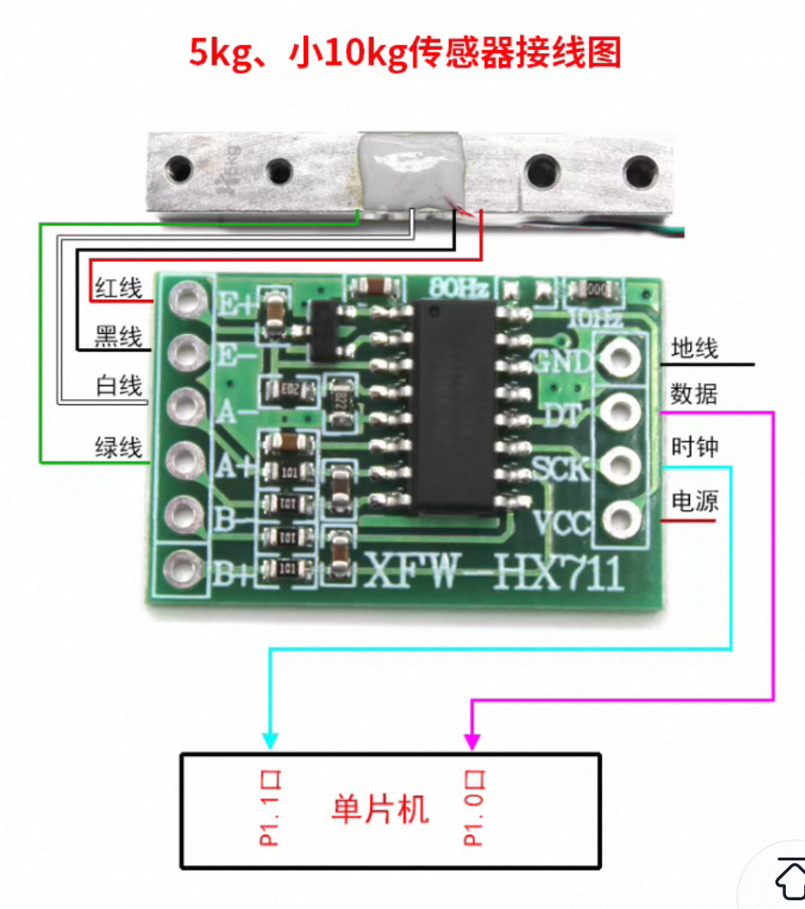
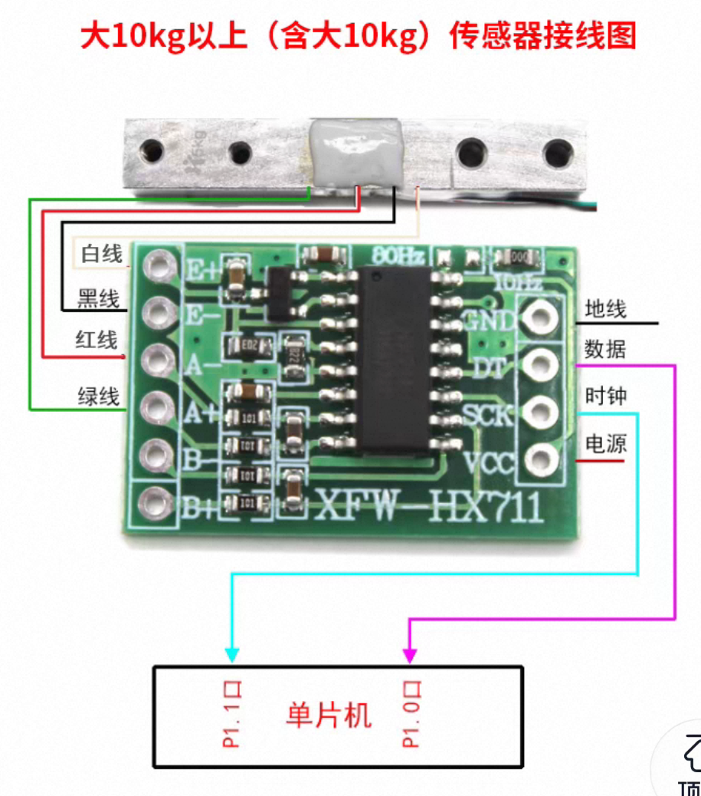
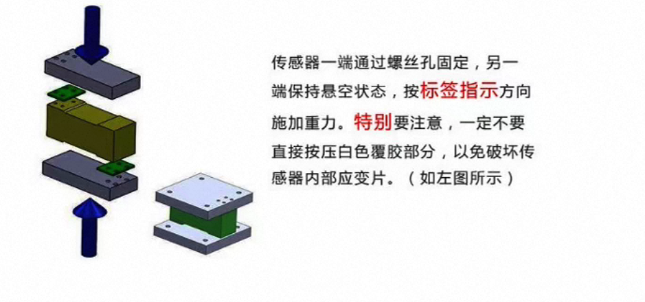

# HX711 力/质量传感器模块使用说明

<p align="center">
  
</p>
<p align="center">图1: 力/质量传感器模块实物</p>

## 📋 BOM 物料清单

| 组件 | 规格/型号 | 数量 | 备注 |
|------|-----------|------|------|
| 开发板 | ESP32-S3 | 1 | 主控制器 |
| HX711 模块 | 24位高精度 ADC | 1 | 信号转换，增益 128（通道A）/ 32（通道B） |
| 称重传感器 | 电阻应变片式 1kg~10kg | 1 | 力/质量测量 |
| 杜邦线 | 公对母 | 4 | VCC, GND, DT, SCK |
| USB 线 | Type-C | 1 | 根据开发板类型 |

---

## 🔌 接线指南

### ESP32-S3 ↔ HX711 模块

```
ESP32-S3 开发板       HX711 模块
──────────────        ──────────
   3.3V           →      VCC
   GND            →      GND
   GPIO4          →      DT (DOUT)
   GPIO5          →      SCK (PD_SCK)
```

<p align="center">
  
</p>
<p align="center">图2: ESP32-S3 与 HX711 模块接线示意图</p>

### HX711 模块 ↔ 称重传感器

```
HX711 模块           称重传感器
───────────          ──────────
   E+            →      激励正极（红色线）
   E-            →      激励负极（黑色线）
   A+            →      通道A正极（绿色线，默认使用）
   A-            →      通道A负极（白色线）
   B+            →      通道B正极（未使用）
   B-            →      通道B负极（未使用）
```

<p align="center">
  
</p>
<p align="center">图3: HX711 模块与称重传感器接线示意图</p>

**固件代码**: [force.ino](force.ino)

**引脚定义** (来自固件):
```cpp
#define HX711_DOUT_PIN 4   // 使用 GPIO4，ESP32-S3 安全引脚
#define HX711_SCK_PIN  5   // 使用 GPIO5，ESP32-S3 安全引脚
#define SAMPLE_INTERVAL 80 // 采样间隔 80ms (12.5Hz)
```

### ⚠️ 接线注意事项

1. **供电电压**：HX711 模块支持 2.7V~5.5V，使用 ESP32-S3 的 3.3V 供电即可
2. **称重传感器线序**：因厂家不同可能有所差异，请以传感器标注为准。常见线序为：红=E+、黑=E-、绿=A+、白=A-
3. **DT/SCK 引脚**：数字信号引脚，连接到 ESP32-S3 的 GPIO4 和 GPIO5
4. **接线牢固**：传感器接线松动会导致读数跳动，请确保所有连接牢固

<p align="center">
  
</p>
<p align="center">图4: 力传感器模块组装注意事项</p>

---

## 🧪 校准方法

### 重要说明

**与传统模块不同**：本项目采用 **Python 程序内校准**，校准参数保存在统一的 `sensor_config.json` 中，而非模块本身。

### 校准原理

使用线性校准：`实际质量 = (当前ADC - offset) × scale`

需要两个校准点：
- **零点**：空载时的 ADC 值（offset）
- **已知质量**：放置已知砝码后的 ADC 值（计算 scale）

### 校准步骤

1. **连接传感器**：确保 HX711 模块和称重传感器接线正确，连接上位机程序

2. **打开上位机程序**：运行 `main.py`，选择力传感器模块

3. **连接串口**：选择正确的 COM 口并连接（支持有线串口和 BLE 蓝牙两种方式）

4. **去皮操作**：
   - 确保称重平台上无负载
   - 点击 **"去皮（TARE）"** 按钮
   - 程序发送 `TARE` 命令，ESP32-S3 重新计算偏移量
   - 收到 `TARE_DONE` 响应后，当前读数归零

5. **校准操作**：
   - 点击 **"校准（CALIBRATE）"** 按钮
   - 确保称重平台空载，点击 **"1. 请空载，点击记录零点"**
   - 在弹出对话框中输入已知砝码质量（如 100g），点击确定
   - 将砝码放置在称重平台上，等待读数稳定
   - 点击 **"2. 已放XXXg砝码，点击记录"**
   - 程序自动计算校准比例并保存

6. **保存配置**：配置会自动保存到 `sensor_config.json`，下次启动自动加载

### 校准示例

假设测量得到：
- 空载 ADC = -58720
- 加载 100g 砝码后 ADC = -52720
- ADC 差值 = -52720 - (-58720) = 6000
- scale = 100 / 6000 = 0.016667
- offset = -58720

当 ADC = -55720 时：
质量 = (-55720 - (-58720)) × 0.016667 = 3000 × 0.016667 = 50.0g

---

## 💻 固件说明

### 数据输出格式

**串口输出**：`时间戳(ms),ADC原始值`

**示例数据**：
```
1234,-58720
1314,-58695
1394,-58701
```

**ADC 配置**：
- 分辨率：24位
- 通道：A（增益 128）
- 采样率：12.5Hz（80ms 间隔）

### 串口命令

| 命令 | 说明 | 响应 |
|------|------|------|
| `TARE\n` | 去皮（清零当前负载） | `TARE_DONE,<offset>` |
| `CALIBRATE\n` | 进入校准模式 | `CALIBRATE_READY,place_known_weight` |

### 固件核心代码

```cpp
#define HX711_DOUT_PIN 4
#define HX711_SCK_PIN  5
#define SAMPLE_INTERVAL 80

void setup() {
  Serial.begin(115200);
  pinMode(HX711_DOUT_PIN, INPUT);
  pinMode(HX711_SCK_PIN, OUTPUT);
  digitalWrite(HX711_SCK_PIN, LOW);
  powerUp();
  delay(500);
  tare(10);
  Serial.println("START");
  delay(500);
}

void loop() {
  if (Serial.available()) {
    String cmd = Serial.readStringUntil('\n');
    cmd.trim();
    if (cmd == "TARE") {
      tare(10);
      Serial.println("TARE_DONE," + String(offset));
    } else if (cmd == "CALIBRATE") {
      Serial.println("CALIBRATE_READY,place_known_weight");
    }
  }
  if (millis() - lastSampleTime >= SAMPLE_INTERVAL) {
    lastSampleTime = millis();
    long rawValue = readHX711Raw();
    Serial.print(millis());
    Serial.print(",");
    Serial.println(rawValue);
  }
  delay(1);
}
```

---

## 🎯 使用说明

### 上位机功能

1. **实时数据显示**：显示当前质量值和 ADC 原始值
2. **数据曲线**：实时绘制质量变化曲线
3. **统计信息**：显示平均值、最大值、最小值、标准差
4. **数据保存**：保存为 CSV 格式（包含时间、ADC、质量值）
5. **去皮操作**：一键去皮，清零当前负载
6. **校准功能**：支持在程序内进行两点校准
7. **双连接方式**：支持有线串口和 BLE 蓝牙连接


### CSV 数据格式

```csv
time_s,raw_adc,force_g
0.000,-58720,0.00
0.080,-58695,0.42
0.160,-58701,0.32
```

---

## ⚠️ 常见问题

### Q1: ADC 值始终为 0
**原因**：DT/SCK 接线错误或未连接
**解决**：
- 检查 DT（GPIO4）和 SCK（GPIO5）接线是否正确
- 确认杜邦线连接牢固，无松动

### Q2: ADC 值跳动很大
**原因**：传感器接线松动、环境振动干扰
**解决**：
- 检查传感器接线是否牢固
- 避免在气流或振动环境中使用
- 确保称重平台稳定

### Q3: 校准后质量不准确
**原因**：空载时不稳定、砝码质量过轻
**解决**：
- 重新校准，确保空载时读数稳定
- 使用更重的砝码进行校准（推荐 100g 以上）

### Q4: 读数为负数
**原因**：称重传感器 A+/A- 接反
**解决**：
- 交换称重传感器的 A+ 和 A- 接线（绿色线与白色线互换）

### Q5: 串口连接失败
**原因**：驱动未安装、USB 线问题、端口被占用
**解决**：
- 安装 CH340/CP2102 驱动
- 更换 USB 线
- 关闭其他可能占用串口的程序

### Q6: BLE 连接失败
**原因**：设备未配对、蓝牙驱动问题
**解决**：
- 先在 Windows 蓝牙设置中配对设备
- 确认已安装 `bleak` 库

---

## 📊 技术参数

| 参数 | 规格 |
|------|------|
| ADC 分辨率 | 24 位 |
| 有效精度 | 约 20 位（取决于传感器） |
| 采样速率 | 10Hz 或 80Hz（由 HX711 速率引脚决定，默认 10Hz） |
| 通道 A 增益 | 128 |
| 通道 B 增益 | 32 |
| 输入电压范围 | ±20mV（通道 A，增益 128） |
| 工作电压 | 2.7V ~ 5.5V |
| 工作电流 | 约 1.5mA |

---

## 🔧 扩展建议

### 多通道采集
可扩展支持多个 HX711 模块同时采集，实现多路力/质量监测。

### 数据记录增强
支持自动定时保存、数据滤波（滑动平均、卡尔曼滤波）等功能。

### 无线传输
利用 ESP32-S3 的 WiFi 功能，实现无线数据传输到手机或云端。

---

**Happy Measuring! ⚖️**
