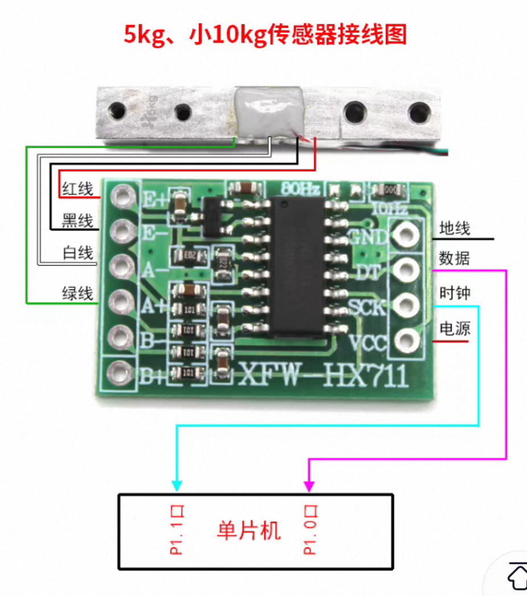
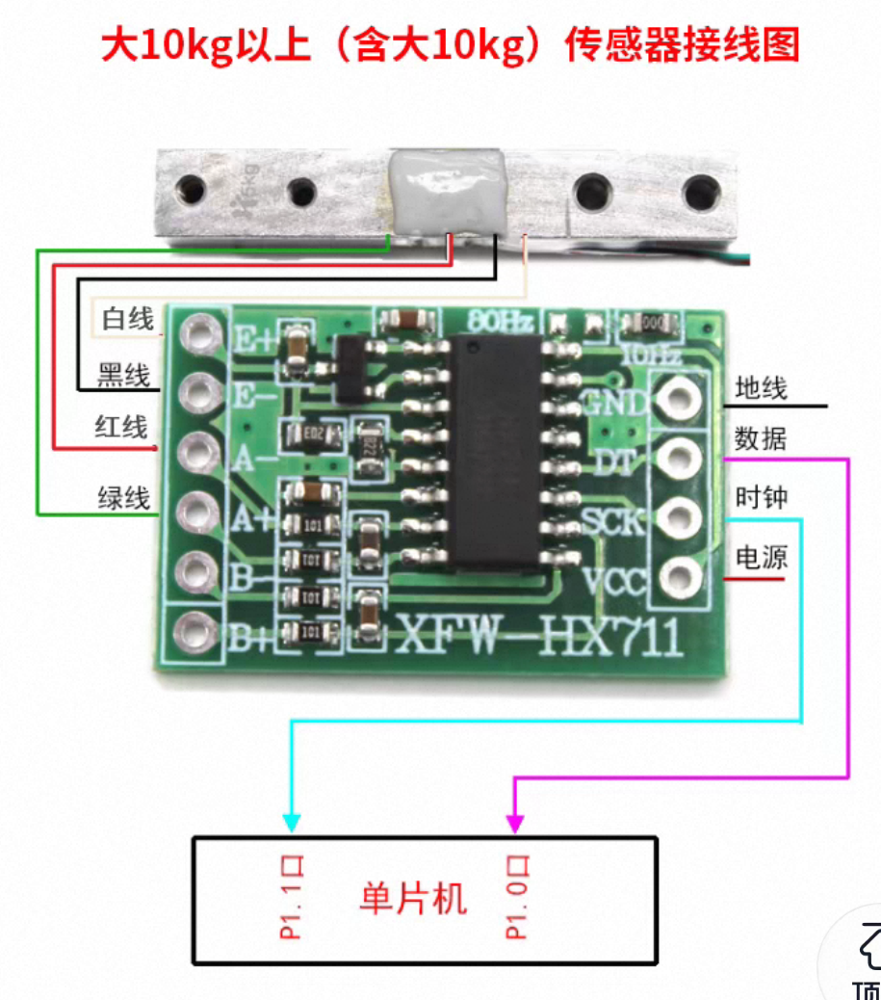
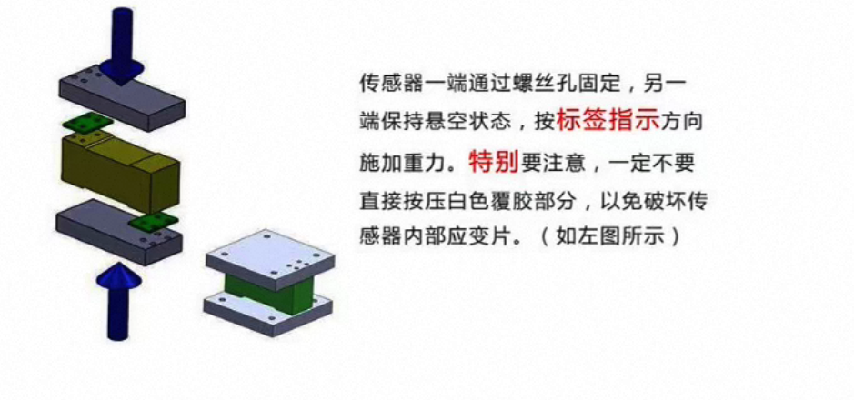

# 力 / 质量传感器

HX711 24 位 ADC + 应变片式称重传感器，配 ESP32-S3 采集。上位机 `force_sensor.py`（主类 `ForceSensorWidget`，侧边栏图标 `F`）支持去皮、两点标定、单位切换（g / kg / N）。

<p align="center">
  
</p>
<p align="center">图1: 力/质量传感器模块实物</p>

## 1.接线

### 1.1.ESP32-S3 ↔ HX711 模块

```
ESP32-S3          HX711
──────────        ──────────
3.3V        →     VCC
GND         →     GND
GPIO4       →     DT (DOUT)
GPIO5       →     SCK (PD_SCK)
```

固件里是 `HX711_DOUT_PIN 4` / `HX711_SCK_PIN 5`，改线要同步改固件。

### 1.2.HX711 ↔ 称重传感器

```
HX711             称重传感器
──────────        ──────────
E+           →    激励正极（红）
E-           →    激励负极（黑）
A+           →    通道A正极（绿，默认使用）
A-           →    通道A负极（白）
B+ / B-      →    未使用
```

不同厂家的称重传感器线序可能不同，以传感器标注为准。接线松动会导致读数跳动。

<p align="center">
  
</p>
<p align="center">图2: ESP32-S3 与 HX711 模块接线示意图</p>

<p align="center">
  
</p>
<p align="center">图3: HX711 模块与称重传感器接线示意图</p>

<p align="center">
  
</p>
<p align="center">图4: 组装注意事项</p>

## 2.BOM

| 组件 | 规格 | 数量 |
|------|------|------|
| 开发板 | ESP32-S3 | 1 |
| HX711 模块 | 24 位 ADC（通道A 增益128 / 通道B 增益32） | 1 |
| 称重传感器 | 自定义 | 1 |
| 杜邦线 | 公对母 | 若干 |
| USB 线 | Type-C | 1 |

## 3.固件、数据格式与命令

固件：`force.ino`（ESP32-S3）

| 项 | 值 |
|----|-----|
| 数据引脚 / 时钟引脚 | GPIO4（DOUT）/ GPIO5（SCK） |
| ADC | 24 位有符号，通道 A、增益 128 |
| 采样间隔 | 80ms（`SAMPLE_INTERVAL 80`），即 12.5Hz |
| 波特率 | 115200 |

开机时固件会先自动做一次 10 次读数的去皮（`tare(10)`），打印配置信息（含当前去皮偏移），最后输出 `START`。

串口输出（每行一条，CSV）：`时间戳(ms),ADC原始值`

```
1234,-58720
1314,-58695
```

### 3.1.串口命令

上位机会自动发送，也可以用串口助手手敲：

| 命令 | 作用 | 响应 |
|------|------|------|
| `TARE` | 去皮（重新取零点） | `TARE_DONE,<offset>` |
| `CALIBRATE` | 进入校准提示 | `CALIBRATE_READY,place_known_weight` |

## 4.校准与去皮

校准在程序里完成，参数写入 `sensor_config.json` 的 `force_sensor` 键。换算关系：

```
质量(克) = (当前ADC − offset) × scale
```

`offset` 是空载去皮零点，`scale` 是标定系数（克/ADC）。未校准时程序直接显示原始 ADC 值，单位栏也会标出来。

### 4.1.去皮（TARE）

点「去皮（TARE）」：有线串口会向固件发 `TARE`，同时上位机取最近一个原始 ADC 值作为 `offset` 并保存配置；读数随即归零。上电、换平台之后清一下零点，用这个最快。

BLE 模式下，如果连接不支持命令通道，点去皮会提示「BLE连接不支持去皮命令，请使用空载校准功能」——那就走下面的两点标定，它第一步本来就是空载取零点。

### 4.2.两点标定步骤

1. 运行 `main.py`，进入力传感器模块，连接设备
2. 点「校准（CALIBRATE）」，**空载**（托盘上什么都不放）记录零点
3. 弹出「校准 - 已知质量」输入框，填入砝码质量（范围 0.01~100000 克，2 位小数）
4. 把砝码放在水平放置的托盘上，点记录按钮
5. 程序自动算出 `offset` 和 `scale` 并保存，校准参数卡显示「校准状态: ✓ 已校准 (比例=…, 偏移=…)」

1). 点击校准按钮

2)空载记录零点


3）拿好砝码，把质量输入程序


4）砝码放在水平放置的力传感器托盘上，点击记录按钮


5）完成


### 4.3.标定示例

空载 ADC −58720，放 100g 砝码后 ADC −52720：

- 差值 = 6000
- scale = 100 / 6000 = 0.016667
- offset = −58720

读数 −55720 时：质量 = (−55720 + 58720) × 0.016667 = 50.0g

### 4.4.单位切换

「实时数据」卡的单位下拉可切克 (g) / 千克 (kg) / 牛顿 (N)：

```
g → kg :  ÷ 1000
g → N  :  ÷ 1000 × 9.8
```

内部统一按克存，只影响显示和保存。未校准时下拉不起作用，一律显示原始 ADC。

## 5.上位机使用

### 5.1.连接方式

下拉框有三项：**有线串口 / BLE蓝牙 / 模拟器**。

BLE 走的是 Nordic UART Service（`6E400001-B5A3-F393-E0A9-E50E24DCCA9E`），本目录的 `force.ino` 只有 USB 串口，不含 BLE 广播。想无线连接得自己把串口输出套进 NUS 骨架里，`超声波位移传感器/csbwithbt.ino` 可以拿来参考。没装 `bleak` 时「BLE蓝牙」项灰显并标注「（未安装bleak）」；没装 pyserial 时模块自动切到模拟器模式。

### 5.2.采样频率

内联可编辑下拉框，预设 10 / 5 / 2 / 1 / 0.5 / 0.2 Hz，也可以手动输入 0.1~10 Hz。上位机默认 10Hz，只能降频——固件以 80ms（12.5Hz）输出，超出的点会被丢弃。

### 5.3.操作步骤

1. 烧录固件，按上文接线
2. 运行 `main.py`，进入力传感器模块
3. 选择连接方式（有线串口 / BLE蓝牙 / 模拟器），连接
4. 先去皮，必要时校准（见第 4 章）
5. 开始采集，观察质量曲线；数据可存为 CSV

### 5.4.实时数据与统计

「实时数据」卡显示当前 ADC 原始值与换算后的克/千克/牛顿读数，校准后单位栏会一并显示当前比例；下方统计栏有数据点、平均、最大、最小、标准差 σ。「清除数据」把曲线、记录和统计一起清掉。

### 5.5.保存数据

点「保存数据」导出 CSV，文件名形如 `force_sensor_data_YYYYmmdd_HHMMSS.csv`，存在运行目录（`main.py` 所在目录）。表头随校准状态变化。

已校准时（`force_{单位}` 随当前单位取 `force_g` / `force_kg` / `force_N`）：

```
time_s,raw_adc,force_g,force_kg
0.000,-58720,0.0000,0.000000
0.100,-55720,50.0000,0.050000
```

| 列 | 含义 |
|----|------|
| `time_s` | 相对开始采集的秒数（首点归零） |
| `raw_adc` | 固件上传的原始 ADC 值（24 位有符号） |
| `force_g` | 换算后的质量，固定以克记录 |
| `force_{单位}` | 按当前显示单位再换算一次（g / kg / N） |

未校准时：

```
time_s,raw_adc,raw_value
0.000,-58720,-58720.0000
```

### 5.6.AI 分析实验

图表卡右上角「AI 分析实验」进对话式 AI，提问时会自动附上当前的数据。系统提示词里写清了 `质量=(raw−offset)×scale` 的换算、蠕变/温漂/振动这些误差来源，以及加载卸载台阶怎么判读，到 AI 窗口「设置 → 模块预置系统提示词」可以查看、修改。详见根目录 [README.md 第 6.7 节](../../README.md)。

## 6.常见问题

**ADC 恒为 0**
- DT（GPIO4）/ SCK（GPIO5）接线错误或松动
- 电源没有接牢

**读数跳动大**
- 传感器接线松动
- 平台不稳或环境振动
- 传感器与 HX711 之间接触电阻变化，或附近有强干扰源

**标定后仍不准 / 标定系数偏大**
- 砝码太轻，建议 100g 以上
- 砝码或传感器实际量程与标称不符
- 上电后没预热就标定，读数还在漂

**读数一直为负**
- 称重传感器 A+ / A- 接反，交换绿白两线

**读数缓慢下沉（蠕变）**
- 应变片传感器的固有蠕变，长时间静态称重时属正常
- 标定时和使用时温度尽量接近，必要时重新去皮

## 7.技术参数

| 参数 | 值 |
|------|-----|
| ADC 分辨率 | 24 位 |
| 有效精度 | 约 20 位（取决于传感器） |
| 通道 A 增益 | 128（±20mV） |
| 通道 B 增益 | 32 |
| 固件采样间隔 | 80ms（12.5Hz） |
| 上位机接收上限 | 10Hz（可降频至 0.1Hz） |
| 工作电压 | 2.7V ~ 5.5V |
| 波特率 | 115200 |

## 图表分析（仅 pyqtgraph）

图表卡左侧有个分析栏，能滚窗口、拟合曲线（线性/二次/三次/对数/幂函数，方程和 R² 直接标在图上）、剔除离群点（剔错了可以撤销，原始数据不动）。设置页能换图表引擎，换完曲线自动重画。详见[传感器代码总览](../README.md)。
